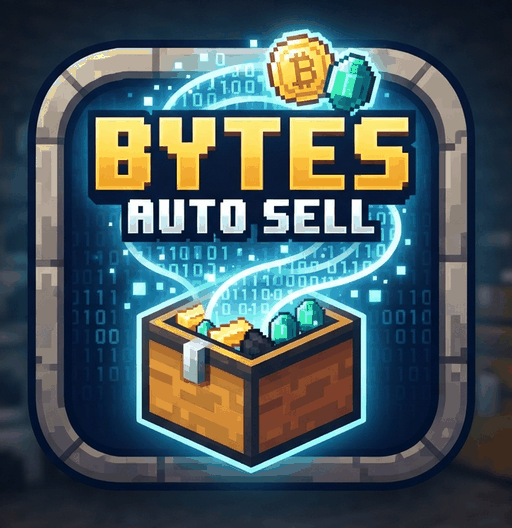

<p align="center">
  
</p>

# Bytes Auto Sell

A client-side Fabric mod that automatically sells your inventory through your server's
sell GUI.

> [!NOTE]
> Automated selling may be against the rules on some servers — check before use.

## Supported versions

| Minecraft | Branch | Java | Fabric API | Mod Menu |
|---|---|---|---|---|
| 1.21.11 | `mc/1.21.11` | 21 | 0.141.6+1.21.11 | 17.0.0 |
| 26.1 | `mc/26.1` | 25 | 0.145.1+26.1 | 18.0.0 |
| 26.1.1 | `mc/26.1.1` | 25 | 0.145.4+26.1.1 | 18.0.0 |
| 26.1.2 | `mc/26.1.2` | 25 | 0.155.2+26.1.2 | 18.0.0 |
| 26.2 | `mc/26.2` | 25 | 0.158.0+26.2 | 20.0.1 |

Each version lives on its own `mc/<version>` branch (see AGENTS.md). Artifact versions
carry the Minecraft version as a suffix (e.g. `1.0.0+mc26.2`).

## Protocol legitimacy

Every network interaction is performed through the vanilla client methods and is
byte-identical on the wire to a player executing the same action manually — see
[docs/PROTOCOL-AUDIT.md](docs/PROTOCOL-AUDIT.md). Only packet *timing* can differ from
human input; use the transfer speed/burst/randomize settings for a human-like cadence.

## Requirements

- A supported Minecraft version (see table above) with its Java runtime
- [Fabric Loader](https://fabricmc.net/use/) and [Fabric API](https://modrinth.com/mod/fabric-api)
- Optional: [Mod Menu](https://modrinth.com/mod/modmenu) — adds a config button for this mod

## Usage

| Keybind (vanilla Controls menu) | Default | Action |
|---|---|---|
| Open Settings | `O` | Opens the Bytes Auto Sell settings screen |
| Toggle Auto Sell | `K` | Enables/disables auto-selling — works everywhere, including inside the sell GUI (not while typing in chat, a book or a sign) |

While enabled, the mod polls your inventory. It keeps its enabled state across
disconnects and resumes automatically on the next server join (press `K` to stop it —
it stays off until you toggle it again). When your inventory contains items it:

1. Runs the configured sell command (default `/sell`) — the server opens its sell GUI.
2. Moves all hotbar + main inventory stacks (never armor/offhand) into the GUI using
   the configured transfer method.
3. Completes the cycle in the configured **Sell Mode**:
   - **Close GUI** — closes the GUI (the server sells on close) and, if items remain
     or new ones arrive, reopens it after the Reopen Delay.
   - **Keep Open** — keeps the GUI open, clicks the configured button slot (default 35)
     to sell, then deposits the next batch after the Reopen Delay.

Toggling the mod off and on again while the sell GUI is open resumes selling in that
same GUI; if you close it in between, the next cycle reopens it via the sell command.

## Settings

All settings are available in-game (`O` keybind, or via Mod Menu) and stored in
`config/bytes-auto-sell.json`.

| Setting | Default | Description |
|---|---|---|
| Sell Command | `/sell` | Command that opens the sell GUI (with or without leading `/`) |
| Sell Mode | Keep Open | How a sell cycle completes (see above) |
| Transfer Method | SHIFT | `SHIFT` = shift-clicks stacks; `PICKUP` = cursor pickup/place into empty slots |
| Item Transfer Speed (ticks) | 1 | Delay between transfer steps — lower is faster |
| Transfer Burst (stacks per tick) | 10 | Stacks moved per step — higher is faster |
| Randomize Transfer Delay | OFF | Randomizes the transfer delay (1x–2x the base) for a less robotic cadence |
| Reopen Delay (ticks) | 20 (1 s) | Delay between sell cycles |
| GUI Title Check | OFF | Only interact with a GUI whose title exactly matches the expected title |
| Expected GUI Title | *(empty)* | Title to match when the check is enabled |
| Keep-Open Button Slot | 35 | Slot clicked to sell in Keep Open mode |
| Check for Updates on Join | ON | Asks GitHub once per server join whether a newer release exists |

**Tip:** with the GUI Title Check disabled, the mod will treat *any* chest-like GUI
that appears right after the sell command as the sell GUI. On servers with other
chest GUIs, enable the check and set the exact sell GUI title.

## Reliability

The mod is built to never crash and never give up, including on high-ping connections:

- **It never disables itself while connected.** A sell GUI that fails to open is
  retried with a capped backoff (5 s → 10 s → 20 s → 30 s); a GUI that closes or is
  replaced mid-cycle is retried after a short cooldown; a full GUI is flushed by
  closing and reopening; a sell button that only picks items up escalates to the same
  reopen recovery.
- **It never drops items.** The cursor stack is always returned (or parked in the
  sell GUI when the inventory is full) before any close or button click; if nothing
  is free anywhere — possible while the server still owes confirmations — the mod
  waits and retries instead of ever closing with a loaded cursor.
- **It never crashes the client.** Every slot click is bounds- and null-checked, and
  the whole state machine is wrapped in a catch-all that resets the current cycle,
  logs, and continues if some unexpected vanilla interaction ever throws.
- High ping is specifically tolerated: button clicks get a full second of grace
  before a loaded cursor is treated as a real pickup, and the sell GUI may take the
  full 5 s command window to appear when the **GUI Title Check** is enabled (the
  exact title proves the GUI is the command's response). With the check disabled the
  acceptance window stays at 1 s so a chest you open yourself is never mistaken for
  the sell GUI — enable the title check on high-ping connections.
- On a server (or in singleplayer) with no sell GUI at all, the mod keeps retrying
  the sell command with the capped backoff — one action-bar message per attempt —
  until you toggle it off with `K`.

## Update check

When you join a multiplayer server, the mod asks GitHub once whether a newer release
of Bytes Auto Sell exists
(`api.github.com/repos/UnlimitedBytes/bytes-auto-sell/releases/latest`)
and, if so, shows a chat message with a clickable link to that release. This single
request is the mod's only network traffic besides the Minecraft connection itself:
it runs asynchronously (never blocks the game), has a 5 s timeout, never retries,
and stays completely silent on any error. It can be disabled in the settings
(*Updates → Check for Updates on Join*).

## Building

```bash
./gradlew build   # jar in build/libs/
./gradlew test    # unit tests only
```

## Development workflow

See [AGENTS.md](AGENTS.md): `main` holds QA-approved releases, `dev` is the
integration branch, features go through `feature/*` branches with a harsh code
review before merging into `dev`, and a QA gate before releasing to `main`.

## License

[MIT](LICENSE) — Copyright (c) 2026 [UnlimitedBytes](https://unlimitedbytes.ovh)
